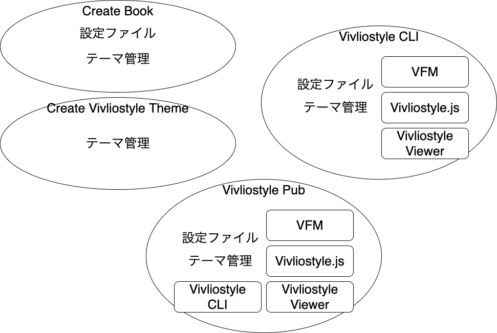

# Theme取得ライブラリの開発

名前 : 高井 歩

何故かVivliostyle Pubの担当になった  
プログラマ

# 現状の問題点

* 複数のプロダクト(Pub,CLIなど)で同じ機能をそれぞれ独自に実装又はファイルを複製して使用している
* そのため、同じVivliostyleプロジェクトを処理しても、プロダクト毎に結果が異なる可能性がある

# 提案

* 共通部分のライブラリ(npmパッケージ)化
* 手始めにテーマ管理を独立したライブラリにする
* CLIやcreate-bookなどの主要な機能を内包するpubをベースに進めて行く

# 機能要件

* npmにvivliostyle-themeとしてタグ付けされているパッケージの一覧取得
* URLを指定してHTTPサーバ,GitHub,ローカルファイルなどからテーマを取得
* テーマファイルやパッケージのダウンロード
* ダウンロード元のアップデートのチェック

# アンケート

1. よく使うテーマの形式は?
1. どうやってテーマを管理してますか?
